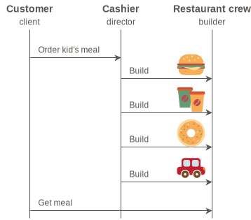

## 建造者模式

想象一下，我们想要创建一个由多个部分构成的对象，而且它的构成需要一步接一步地完成。只有当各个部分都创建好，这个对象才算是完整的。这正是建造者设计模式(Builder design pattern)的用武之地。建造者模式将一个复杂对象的构造过程与其表现分离，这样，同一个构造过程可用于创建多个不同的表现。

我们来看个实际的例子，这可能有助于理解建造者模式的目的。假设我们想要创建一个HTML页面生成器，HTML页面的基本结构(构造组件)通常是一样的：以<html>作为开始和以</html>作为结束，在HTML部分中有<head>和</head>元素，在head部分中又有<title>和</title>元素，等等；但页面在表现上可以不同。每个页面有自己的页面标题、文本标题以及不同的<body>内容。此外，页面通常是经过多个步骤创建完成的：有一个函数添加页面标题，另一个添加主文本标题，还有一个添加页脚，等等。仅当一个页面的结构全部完成后，才能使用一个最终的渲染函数将该页面展示在客户端。我们甚至可以更进一步扩展这个HTML生成器，让它可以生成一些完全不同的HTML页面。一个页面可能包含表格，另一个页面可能包含图像库，还有一个页面包含联系表单，等等。

HTML页面生成问题可以使用建造者模式来解决。该模式中，有两个参与者：建造者(builder) 和指挥者(director)。建造者负责创建复杂对象的各个组成部分。在HTML例子中，这些组成部分是页面标题、文本标题、内容主体及页脚。指挥者使用一个建造者实例控制建造的过程。对于HTML示例，这是指调用建造者的函数设置页面标题、文本标题等。使用不同的建造者实例让我们可以创建不同的HTML页面，而无需变更指挥者的代码。


```python
#!/usr/bin/python
# -*- coding : utf-8 -*-

"""
@author: Diogenes Augusto Fernandes Herminio <diofeher@gmail.com>
https://gist.github.com/420905#file_builder_python.py
"""


# Director
class Director(object):

    def __init__(self):
        self.builder = None

    def construct_building(self):
        self.builder.new_building()
        self.builder.build_floor()
        self.builder.build_size()

    def get_building(self):
        return self.builder.building


# Abstract Builder
class Builder(object):

    def __init__(self):
        self.building = None

    def new_building(self):
        self.building = Building()

    def build_floor(self):
        raise NotImplementedError

    def build_size(self):
        raise NotImplementedError

# Concrete Builder
class BuilderHouse(Builder):

    def build_floor(self):
        self.building.floor = 'One'

    def build_size(self):
        self.building.size = 'Big'


class BuilderFlat(Builder):

    def build_floor(self):
        self.building.floor = 'More than One'

    def build_size(self):
        self.building.size = 'Small'


# Product
class Building(object):

    def __init__(self):
        self.floor = None
        self.size = None

    def __repr__(self):
        return 'Floor: {0.floor} | Size: {0.size}'.format(self)


# Client
if __name__ == "__main__":
    director = Director()
    director.builder = BuilderHouse()
    director.construct_building()
    building = director.get_building()
    print(building)
    director.builder = BuilderFlat()
    director.construct_building()
    building = director.get_building()
    print(building)

### OUTPUT ###
# Floor: One | Size: Big
# Floor: More than One | Size: Small

```

## 现实中的例子

快餐店使用的就是建造者设计模式。即使存在多种汉堡包（经典款、奶酪汉堡包等）和不同包装（小盒子、中等大小盒子等），准备一个汉堡包及打包（盒子或纸袋）的流程都是相同的。经典款汉堡包和奶酪汉堡包之间的区别在于表现，而不是建造过程。指挥者是出纳员，将需要准备什么餐品的指令传达给工作人员，建造者是工作人员中的个体，关注具体的顺序。展示了统一建模语言（UML）的流程图，说M明当一个儿童套餐下单：



## 实际软件的示例：

本章一开始提到的HTML例子，在django-widgy中得到了实际应用。django-widgy是一个 Django的第三方树编辑器扩展，可用作内容管理系统(Content Management System，CMS)。它 包含一个网页构建器，用来创建具有不同布局的HTML页面。

django-query-builder是另一个基于建造者模式的Django第三方扩展库，该扩展库可用于动态 地构建SQL查询。使用它，我们能够控制一个查询的方方面面，并能创建不同种类的查询，从简 单的到非常复杂的都可以

## 应用案例


如果我们知道一个对象必须经过多个步骤来创建并且要求同一个构造过程可以产生不同的表现，就可以使用建造者模式。这种需求存在于许多应用中，例如页面生成器(本章提到的HTML 页面生成器之类)、文档转换器(请参考[GOF95，第110页])以及用户界面(User Interface， UI)表单创建工具(请 [参考网页](t.cn/RqBBDwb))。

有些资料提到建造者模式也可用于解决可伸缩构造函数问题(请[参考网页](t.cn/RGcGaLD))。 当我们为支持不同的对象创建方式而不得不创建一个新的构造函数时，可伸缩构造函数问题就发生了，这种情况最终产生许多构造函数和长长的形参列表，难以管理。Stack Overflow网站上列出了一个可伸缩构造函数的例子(请参考网页[t.cn/RqBrwzP])。幸运的是，这个问题在Python中并不存在，因为至少有以下两种方式可以解决这个问题。

* 使用命名形参(请[参考网页](t.cn/RqBrUyV))
* 使用实参列表展开(请[参考网页](t.cn/RyHhfg3))

在这一点上，建造者模式和工厂模式的差别并不太明确。**主要的区别** 在于工厂模式以单个步骤创建对象，而建造者模式以多个步骤创建对象，并且几乎始终会使用一个指挥者。一些有针对性的建造者模式实现并未使用指挥者，如Java的StringBuilder，但这只是例外。

**另一个区别** 是，在工厂模式下，会立即返回一个创建好的对象；而在建造者模式下，仅在需要时客户端代码才显式地请求指挥者返回最终的对象(请参考[GOF95，第113页]和[网页](t.cn/RqBBKyf))。

新电脑类比的例子也许有助于区分建造者模式和工厂模式。假设你想购买一台新电脑，如果决定购买一台特定的预配置的电脑型号，例如，最新的苹果1.4GHz Mac mini，则是在使用工厂模式。所有硬件的规格都已经由制造商预先确定，制造商不用向你咨询就知道自己该做些什么，它们通常接收的仅仅是单条指令。在代码级别上，看起来是下面这样的(apple-factory.py)。

```python
MINI14 = '1.4GHz Mac mini'
class AppleFactory:
    class MacMini14:
        def __init__(self):
            self.memory = 4 # 单位为GB
            self.hdd = 500 # 单位为GB
            self.gpu = 'Intel HD Graphics 5000'

        def __str__(self):
            info = ('Model: {}'.format(MINI14)，
                     'Memory: {}GB'.format(self.memory)，
                     'Hard Disk: {}GB'.format(self.hdd)，
                     'Graphics Card: {}'.format(self.gpu))
            return '\n'.join(info)

    def build_computer(self， model):
        if (model == MINI14):
            return self.MacMini14()
        else:
            print("I dont't know how to build {}".format(model))

afac = AppleFactory()
mac_mini = afac.build_computer(MINI14)
print(mac_mini)
```
将得到的输出为：

    Model: 1.4GHz Mac mini
    Memory: 4GB
    Hard Disk: 500GB
    Graphics Card: Intel HD Graphics 5000


这里嵌套了MacMini14类。这是禁止直接实例化一个类的简洁方式

另一个选择是购买一台定制的PC。假若这样，使用的即是建造者模式。你是指挥者，向制 造商(建造者)提供指令说明心中理想的电脑规格。在代码方面，看起来是下面这样的:


```python
class Computer:
    def __init__(self， serial_number):
        self.serial = serial_number
        self.memory = None # 单位为GB
        self.hdd = None # 单位为GB
        self.gpu = None

    def __str__(self):
        info = ('Memory: {}GB'.format(self.memory)，
                'Hard Disk: {}GB'.format(self.hdd)，
                'Graphics Card: {}'.format(self.gpu))
        return '\n'.join(info)


class ComputerBuilder:
    def __init__(self):
        self.computer = Computer('AG23385193')
    def configure_memory(self， amount):
        self.computer.memory = amount
    def configure_hdd(self， amount):
        self.computer.hdd = amount
    def configure_gpu(self， gpu_model):
        self.computer.gpu = gpu_model

class HardwareEngineer:
    def __init__(self):
        self.builder = None
    def construct_computer(self， memory， hdd， gpu):

        self.builder = ComputerBuilder()
        [step for step in (self.builder.configure_memory(memory)，
                           self.builder.configure_hdd(hdd)，
                           self.builder.configure_gpu(gpu))]

    @property
    def computer(self):
        return self.builder.computer

engineer = HardwareEngineer()
engineer.construct_computer(hdd=500， memory=8， gpu='GeForce GTX 650 Ti')
computer = engineer.computer
print(computer)

```
得到的输出将为：

    Memory: 8GB
    Hard Disk: 500GB
    Graphics Card: GeForce GTX 650 Ti


基本的变化是引入了一个建造者ComputerBuilder、一个指挥者HardwareEngineer以及 一步接一步装配一台电脑的过程，这样现在就支持不同的配置了(注意，memory、hdd及gpu是形参，并未预先设置)。如果我们想要支持平板电脑的装配，那又需要做些什么呢?作为练习来实现它吧。

你或许还想将每台电脑的serial_number变得都不一样，因为现在所有电脑的序列号都相同，这是不符合实际情况的。

# 实现

让我们来看看如何使用建造者设计模式实现一个比萨订购的应用。比萨的例子特别有意思，因为准备好一个比萨需经过多步操作，且这些操作要遵从特定顺序。要添加调味料，你得先准备生面团。要添加配料，你得先添加调味料。并且只有当生面团上放了调味料和配料之后才能开始烤比萨。此外，每个比萨通常要求的烘培时间都不一样，依赖于生面团的厚度和使用的配料。

先导入要求的模块，声明一些Enum参数(请参考网页[t.cn/RqBrIpz])以及一个在应用中会使用多次的常量。常量STEP_DELAY用于在准备一个比萨的不同步骤(准备生面团、添加调味料等)之间添加时间延迟，如下所示。


```python
from enum import Enum
PizzaProgress = Enum('PizzaProgress'， 'queued preparation baking ready')
PizzaDough = Enum('PizzaDough'， 'thin thick')
PizzaSauce = Enum('PizzaSauce'， 'tomato creme_fraiche')
PizzaTopping = Enum('PizzaTopping'， 'mozzarella double_mozzarella bacon ham mushrooms red_onion oregano')
STEP_DELAY = 3 # 考虑是示例，所以单位为秒

```

**最终的产品是一个比萨，由Pizza类描述。若使用建造者模式，则最终产品(类)并没有多少职责，因为它不支持直接实例化。建造者会创建一个最终产品的实例，并确保这个实例完全准备好。这就是Pizza类这么短小的缘由**。它只是将所有数据初始化为合理的默认值，唯一的例外是方法prepare_dough()。将prepare_dough方法定义在Pizza类而不是建造者中，是考虑到以下两点：

* 为了澄清一点，就是虽然最终产品类通常会最小化，但这并不意味着绝不应该给它分配任何职责
* 为了通过组合提高代码复用


```python
class Pizza:
    def __init__(self， name):
        self.name = name
        self.dough = None
        self.sauce = None
        self.topping = []

    def __str__(self):
        return self.name

    def prepare_dough(self， dough):
        self.dough = dough
        print('preparing the {} dough of your {}...'.format(self.dough.name， self)) time.sleep(STEP_DELAY)
        print('done with the {} dough'.format(self.dough.name))
```

该应用中有两个建造者：一个制作玛格丽特比萨(MargaritaBudiler)，另一个制作奶油熏肉比萨(CreamyBaconBuilder)。每个建造者都创建一个Pizza实例，并包含遵从比萨制作流程的方法：prepare_dough()、add_sauce、add_topping()和bake()。准确来说，其中的prepare_dough只是对Pizza类中prepare_dough()方法的一层封装。注意每个建造者是如何处理所有比萨相关细节的。例如，玛格丽特比萨的配料是双层马苏里拉奶酪(mozzarella)和牛至(oregano)，而奶油熏肉比萨的配料是马苏里拉奶酪(mozzarella)、熏肉(bacon)、火腿(ham)、蘑菇(mushrooms)、紫洋葱(red onion)和牛至(oregano)，如下面的代码所示：

```python
class MargaritaBuilder:
    def __init__(self):
        self.pizza = Pizza('margarita')
        self.progress = PizzaProgress.queued
        self.baking_time = 5 # 考虑是示例，单位为秒

    def prepare_dough(self):
        self.progress = PizzaProgress.preparation
        self.pizza.prepare_dough(PizzaDough.thin)

    def add_sauce(self):
        print('adding the tomato sauce to your margarita...')
        self.pizza.sauce = PizzaSauce.tomato
        time.sleep(STEP_DELAY)
        print('done with the tomato sauce')

    def add_topping(self):
        print('adding the topping (double mozzarella， oregano) to your margarita')
        self.pizza.topping.append([i for i in (PizzaTopping.double_mozzarella， PizzaTopping.oregano)])
            time.sleep(STEP_DELAY)
        print('done with the topping (double mozzarella， oregano)')

    def bake(self):
        self.progress = PizzaProgress.baking
        print('baking your margarita for {} seconds'.format(self.baking_time))
        time.sleep(self.baking_time)
        self.progress = PizzaProgress.ready
        print('your margarita is ready')

class CreamyBaconBuilder:
    def __init__(self):
        self.pizza = Pizza('creamy bacon')
        self.progress = PizzaProgress.queued
        self.baking_time = 7 # 考虑是示例，单位为秒

    def prepare_dough(self):
        self.progress = PizzaProgress.preparation
        self.pizza.prepare_dough(PizzaDough.thick)

    def add_sauce(self):
        print('adding the crème fraîche sauce to your creamy bacon')
        self.pizza.sauce = PizzaSauce.creme_fraiche
        time.sleep(STEP_DELAY)
        print('done with the crème fraîche sauce')

    def add_topping(self):
        print('adding the topping (mozzarella，bacon，ham，mushrooms，red onion，oregano) to your creamy bacon')
        self.pizza.topping.append([t for t in (PizzaTopping.mozzarella， PizzaTopping.bacon，
            PizzaTopping.ham，PizzaTopping.mushrooms，
            PizzaTopping.red_onion， PizzaTopping.oregano)])
        time.sleep(STEP_DELAY)
        print('done with the topping (mozzarella，bacon，ham，mushrooms，red onion，oregano)')

    def bake(self):
        self.progress = PizzaProgress.baking
        print('baking your creamy bacon for {} seconds'.format(self.baking_time))
        time.sleep(self.baking_time)
        self.progress = PizzaProgress.ready
        print('your creamy bacon is ready')
```

在这个例子中，指挥者就是服务员。Waiter类的核心是construct_pizza方法，该方法接 受一个建造者作为参数，并以正确的顺序执行比萨的所有准备步骤。选择恰当的建造者(甚至可 以在运行时选择)，无需修改指挥者(Waiter)的任何代码，就能制作不同的比萨。Waiter类 还包含pizza()方法，会向调用者返回最终产品(准备好的比萨)，如下所示。


```python
class Waiter:
    def __init__(self):
        self.builder = None

    def construct_pizza(self， builder):
        self.builder = builder
        [step() for step in (builder.prepare_dough， builder.add_sauce， builder.add_topping， builder.bake)]

    @property
    def pizza(self):
        return self.builder.pizza
```

函数validate_style()类似于第1章中描述的validate_age()函数，用于确保用户提供 有效的输入，当前案例中这个输入是映射到一个比萨建造者的字符；输入字符m表示使用 MargaritaBuilder类，输入字符c则使用CreamyBaconBuilder类。这些映射关系存储在参数 builder中。该函数会返回一个元组，如果输入有效，则元组的第一个元素被设置为True，否则为False，如下所示。


```python
def validate_style(builders):
    try:
        pizza_style = input('What pizza would you like， [m]argarita or [c]reamy bacon? ')
        builder = builders[pizza_style]()
        valid_input = True
    except KeyError as err:
        print('Sorry， only margarita (key m) and creamy bacon (key c) are available')
        return (False， None)
    return (True， builder)
```

实现的最后一部分是main()函数。main()函数实例化一个比萨建造者，然后指挥者Waiter使用比萨建造者来准备比萨。创建好的比萨可在稍后的时间点交付给客户端。

```python
def main():
    builders = dict(m=MargaritaBuilder， c=CreamyBaconBuilder)
    valid_input = False
    while not valid_input:
        valid_input， builder = validate_style(builders)
    print()
    waiter = Waiter()
    waiter.construct_pizza(builder)
    pizza = waiter.pizza
    print()
    print('Enjoy your {}!'.format(pizza))
```

将所有代码片段拼接在一起，示例的完整代码(builder.py) 如下所示。


```python
from enum import Enum


import time
PizzaProgress   = Enum('PizzaProgress', 'queued preparation baking ready')
PizzaDough      = Enum('PizzaDough', 'thin thick')
PizzaSauce      = Enum('PizzaSauce', 'tomato creme_fraiche')
PizzaTopping    = Enum(
    'PizzaTopping',
    'mozzarella double_mozzarella bacon ham mushrooms red_onion oregano')

STEP_DELAY = 3


class Pizza:

    def __init__(self， name):
        self.name = name
        self.dough = None
        self.sauce = None
        self.topping = []

    def __str__(self):
        return self.name

    # in seconds for the sake of the
    def prepare_dough(self， dough):
        self.dough = dough
        print('preparing the {} dough of your {}...'.format(
            self.dough.name， self))
        time.sleep(STEP_DELAY)
        print('done with the {} dough'.format(self.dough.name))


class MargaritaBuilder:

    def __init__(self):
        self.pizza = Pizza('margarita')
        self.progress = PizzaProgress.queued
        self.baking_time = 5      # in seconds for the sake of the example

    def prepare_dough(self):
        self.progress = PizzaProgress.preparation
        self.pizza.prepare_dough(PizzaDough.thin)

    def add_sauce(self):
        print('adding the tomato sauce to your margarita...')
        self.pizza.sauce = PizzaSauce.tomato
        time.sleep(STEP_DELAY)
        print('done with the tomato sauce')

    def add_topping(self):
        print('adding the topping (double mozzarella， oregano) to your margarita')
        self.pizza.topping.append([i for i in
        (PizzaTopping.double_mozzarella， PizzaTopping.oregano)])
        time.sleep(STEP_DELAY)
        print('done with the topping (double mozzarrella， oregano)')

    def prepare_dough(self):
        self.progress = PizzaProgress.preparation
        self.pizza.prepare_dough(PizzaDough.thin)

    def add_sauce(self):
        print('adding the tomato sauce to your margarita...')
        self.pizza.sauce = PizzaSauce.tomato
        time.sleep(STEP_DELAY)
        print('done with the tomato sauce')

    def add_topping(self):
        print('adding the topping (double mozzarella， oregano) to your margarita')
        self.pizza.topping.append([i for i in
            (PizzaTopping.double_mozzarella， PizzaTopping.oregano)])
        time.sleep(STEP_DELAY)
        print('done with the topping (double mozzarrella， oregano)')

    def bake(self):
        self.progress = PizzaProgress.baking
        print('baking your margarita for {} seconds'.format(self.baking_time))
        time.sleep(self.baking_time)
        self.progress = PizzaProgress.ready
        print('your margarita is ready')


class CreamyBaconBuilder:

    def __init__(self):
        self.pizza = Pizza('creamy bacon')
        self.progress = PizzaProgress.queued
        self.baking_time = 7      # in seconds for the sake of the example

    def prepare_dough(self):
       self.progress = PizzaProgress.preparation
       self.pizza.prepare_dough(PizzaDough.thick)

    def add_sauce(self):
        print('adding the crème fraîche sauce to your creamy bacon')
        self.pizza.sauce = PizzaSauce.creme_fraiche
        time.sleep(STEP_DELAY)
        print('done with the crème fraîche sauce')

    def add_topping(self):
        print('adding the topping (mozzarella， bacon， ham， mushrooms， red onion， oregano) to your creamy bacon')
        self.pizza.topping.append([t for t in (PizzaTopping.mozzarella， PizzaTopping.bacon，
            PizzaTopping.ham， PizzaTopping.mushrooms，
            PizzaTopping.red_onion， PizzaTopping.oregano)])
        time.sleep(STEP_DELAY)
        print('done with the topping (mozzarella， bacon， ham， mushrooms， red onion， oregano)')

    def bake(self):
        self.progress = PizzaProgress.baking
        print('baking your creamy bacon for {} seconds'.format(self.baking_time))
        time.sleep(self.baking_time)
        self.progress = PizzaProgress.ready
        print('your creamy bacon is ready')


class Waiter:
    def __init__(self):
        self.builder = None

    def construct_pizza(self， builder):
        self.builder = builder
        [step() for step in (builder.prepare_dough，
            builder.add_sauce， builder.add_topping， builder.bake)]

    @property
    def pizza(self):
        return self.builder.pizza


def validate_style(builders):
    try:
        pizza_style = input('What pizza would you like， [m]argarita or [c]reamy bacon? ')
        builder = builders[pizza_style]()
        valid_input = True
    except KeyError as err:
        print('Sorry， only margarita (key m) and creamy bacon (key c) are available')
        return (False， None)
    return (True， builder)


def main():
    builders = dict(m=MargaritaBuilder， c=CreamyBaconBuilder)
    valid_input = False
    while not valid_input:
        valid_input， builder = validate_style(builders)
    print()
    waiter = Waiter()
    waiter.construct_pizza(builder)
    pizza = waiter.pizza
    print()
    print('Enjoy your {}!'.format(pizza))

if __name__ == '__main__':
    main()

```

    What pizza would you like， [m]argarita or [c]reamy bacon? m

    preparing the thin dough of your margarita...
    done with the thin dough
    adding the tomato sauce to your margarita...
    done with the tomato sauce
    adding the topping (double mozzarella， oregano) to your margarita
    done with the topping (double mozzarrella， oregano)
    baking your margarita for 5 seconds
    your margarita is ready

    Enjoy your margarita!


程序仅支持两种比萨类型是挺丢脸的。你自己再来实现一个夏威夷比萨建造者。权衡利弊之后考虑一下是否使用继承。看看典型夏威夷比萨的原料，再决定通过扩展哪个类来实现: MargaritaBuilder 或 CreamyBaconBuilder？或许两者皆扩展(请参考网页[t.cn/RqBr- XK5])？

在Effective Java (2nd edition)一书中，Joshua Bloch描述了一种有趣的建造者模式变体，这种 变体会链式地调用建造者方法，通过将建造者本身定义为内部类并从其每个设置器方法返回自身 来实现。方法build()返回最终的对象。这个模式被称为**流利的建造者**。以下是其Python实现， 由本书的一位评审人友情提供。


```python
class Pizza:
    def __init__(self， builder):
        self.garlic = builder.garlic
        self.extra_cheese  = builder.extra_cheese

    def __str__(self):
        garlic = 'yes' if self.garlic else 'no'
        cheese = 'yes' if self.extra_cheese else 'no'
        info = ('Garlic: {}'.format(garlic)， 'Extra cheese: {}'.format(cheese))
        return '\n'.join(info)


class PizzaBuilder:
    def __init__(self):
        self.extra_cheese = False
        self.garlic = False

    def add_garlic(self):
        self.garlic = True
        return self

    def add_extra_cheese(self):
        self.extra_cheese = True
        return self

    def build(self):
        return Pizza(self)


if __name__ == '__main__':
    pizza = Pizza.PizzaBuilder().add_garlic().add_extra_cheese().build()
    print(pizza)
```

你可以尝试一下把流利的建造者模式应用到比萨的例子。哪个版本你更喜欢？每个版本的优势和劣势又是什么？

## 小结

本章中，我们学习了如何使用建造者设计模式。可以在工厂模式(工厂方法或抽象工厂)不 适用的一些场景中使用建造者模式创建对象。在以下几种情况下，与工厂模式相比，建造者模式 是更好的选择。

* 想要创建一个复杂对象(对象由多个部分构成，且对象的创建要经过多个不同的步骤， 这些步骤也许还需遵从特定的顺序)
* 要求一个对象能有不同的表现，并希望将对象的构造与表现解耦 
* 想要在某个时间点创建对象，但在稍后的时间点再访问

我们看到了快餐店如何将建造者模式用于准备食物，两个第三方Django扩展包(django-widgy 和django-query-builder)各自如何使用建造者模式来生成HTML页面和动态的SQL查询。我们重 点学习了建造者模式与工厂模式之间的区别，通过对预先配置(工厂)电脑与客户定制(建造者) 电脑进行订单类比来理清这两种设计模式。

在实现部分，我们学习了如何创建一个比萨订购应用，该应用能处理比萨准备过程的步骤依 赖。本章推荐了很多有趣的练习题，包括实现一个流利的建造者模式。
